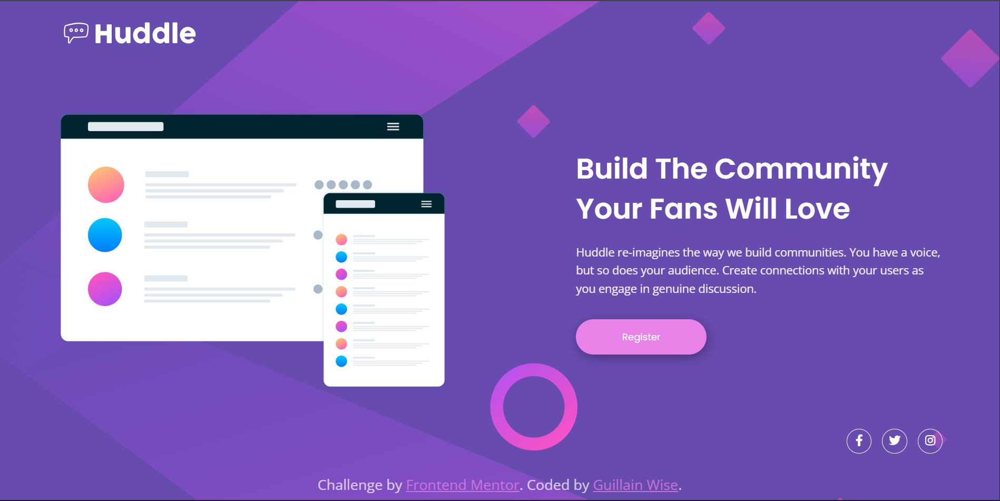

# Frontend Mentor - Huddle landing page with single introductory section solution

This is a solution to the [Huddle landing page with single introductory section challenge on Frontend Mentor](https://www.frontendmentor.io/challenges/huddle-landing-page-with-a-single-introductory-section-B_2Wvxgi0). Frontend Mentor challenges help you improve your coding skills by building realistic projects. 

## Table of contents

- [Overview](#overview)
  - [The challenge](#the-challenge)
  - [Screenshot](#screenshot)
  - [Links](#links)
- [My process](#my-process)
  - [Built with](#built-with)
  - [What I learned](#what-i-learned)
  - [Continued development](#continued-development)
  - [Useful resources](#useful-resources)
  - [AI Collaboration](#ai-collaboration)
- [Author](#author)
- [Acknowledgments](#acknowledgments)

## Overview

This code confidently creates a modern, responsive landing page with a mobile-first approach, ensuring an exceptional look on smartphones before seamlessly adapting to larger screens. It is structured using semantic HTML5, effectively organizing the header, main content, and footer. The layout is expertly managed with CSS3 Flexbox, which stacks elements vertically on mobile devices and transitions to a side-by-side horizontal view on desktop using media queries. By leveraging CSS variables for consistent branding and SVG background images that adjust perfectly to the viewport size, this code guarantees a high-performance, professional user interface that remains crisp and functional across all devices.

### The challenge

Users should be able to:

- View the optimal layout for the page depending on their device's screen size
- See hover states for all interactive elements on the page

### Screenshot



### Links

- Solution URL: [Frontend Mentor Solution]()
- Live Site URL: [GitHub Pages / Vercel Live Site]()

## My process

### Built with

- Semantic HTML5 markup
- CSS custom properties
- Flexbox
- Mobile-first workflow
- Google Fonts (Poppins and Open Sans)
- Font Awesome for social icons

### What I learned

During this project, I focused on creating a responsive layout that adapts smoothly from mobile to desktop. I enjoyed working with CSS variables to manage the theme colors and using Flexbox for alignment.

Example of using Flexbox to switch from column to row layout on larger screens:

```css
.container {
    display: flex;
    flex-direction: column; 
    align-items: center;
    text-align: center;
    gap: 50px;
}

@media (min-width: 1024px) {
    .container {
        flex-direction: row; 
        text-align: left;
    }
}
```

I also practiced adding smooth hover effects to interactive elements:

```css
.btn-register:hover {
    background: hsl(300, 69%, 71%);
    color: white;
}
```

### Continued development

In future projects, I want to explore more complex Grid layouts and perhaps integrate some simple animations to make the page feel even more dynamic.

### Useful resources

- [A Complete Guide to Flexbox](https://css- tricks.com/snippets/css/a-guide-to-flexbox/) - This was invaluable for understanding how to align items properly within the container.
- [Google Fonts](https://fonts.google.com/) - Provided the beautiful typography for the project.

### AI Collaboration

I used AI coding assistants during this project, following the guidelines provided in the AGENTS.md file. The AI helped me understand concepts and provided hints without writing the code for me, which allowed me to learn by doing.

## Author

- Frontend Mentor - [@guillainwise-glitch](https://www.frontendmentor.io/profile/guillainwise-glitch)
- Twitter - [@GuillainWi84543](https://x.com/GuillainWi84543)

## Acknowledgments

Thanks to Frontend Mentor for providing this challenge. It was a great way to brush up on fundamental layout skills.
